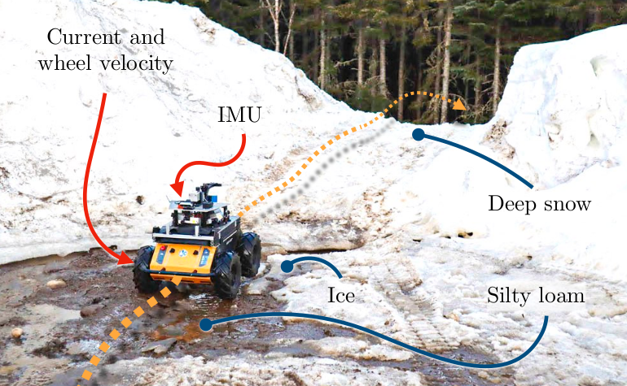

# Proprioception Is All You Need: Terrain Classification for Boreal Forests



> **Proprioception Is All You Need: Terrain Classification for Boreal Forests**\
> Damien LaRocque, William Guimont-Martin, David-Alexandre Duclos, Philippe Giguère, Francois Pomerleau\
> Paper: https://arxiv.org/abs/2403.16877

This repo contains the source code and the datasets used in our paper _Proprioception Is All You Need: Terrain Classification for Boreal Forests_ that was submitted to the 2024 IEEE/RSJ International Conference on Intelligent Robots and Systems (IROS 2024).

## Source Code

Most functions are available in the [`utils`](utils/) directory :

* [`utils/preprocessing.py`](utils/preprocessing.py) contains the preprocessing pipeline
* [`utils/models.py`](utils/models.py) contains the code for the trained models
* [`utils/frequency.py`](utils/frequency.py) contains the functions for the multi-channel spectrogram

### Installation

We recommend installing the dependencies of the repo in a virtual environment.
Two dependencies, [`mamba-ssm`](https://github.com/state-spaces/mamba) and [`causal-conv1d`](https://github.com/Dao-AILab/causal-conv1d) require a NVIDIA GPU.

```sh
python3.10 -m venv .venv
. .venv/bin/activate
pip install -r requirements.txt
```

## Dataset

The `data` directory contains two different datasets:

* the `BorealTC` dataset, our publicly available dataset
* the `Vulpi` dataset, from the 2021 [paper](https://doi.org/10.1016/j.jterra.2020.12.002) of Vulpi et al. This dataset is originally sourced from their repository [Ph0bi0/T_DEEP](https://github.com/Ph0bi0/T_DEEP). The original data is available in the form of `.mat` files. We converted their data in `*.csv` files to work in Python.

Each experiment is provided in two files `imu_XX.csv` and `pro_XX.csv`, for the IMU and the wheel service data, respectively.
Both datasets are organized as the following :

```sh
data
├── borealtc
│   ├── CLASS1
│   │   ├── imu_00.csv
│   │   ├── imu_01.csv
│   │   ├── ...
│   │   ├── pro_00.csv
│   │   ├── pro_01.csv
│   │   └── ...
│   └── CLASS2
│       ├── imu_00.csv
│       ├── imu_01.csv
│       ├── ...
│       ├── pro_00.csv
│       ├── pro_01.csv
│       └── ...
└── vulpi
    ├── CLASS1
    │   ├── imu_1.csv
    │   ├── imu_2.csv
    │   ├── ...
    │   ├── pro_1.csv
    │   ├── pro_2.csv
    │   └── ...
    └── CLASS2
        ├── imu_1.csv
        ├── imu_2.csv
        ├── ...
        ├── pro_1.csv
        ├── pro_2.csv
        └── ...
```

## Acknowledgments

We would like to acknowledge Fabio Vulpi, Annalisa Milella, Roberto Marani and Giulio Reina for their paper [_Recurrent and convolutional neural networks for deep terrain classification by autonomous robots_](https://doi.org/10.1016/j.jterra.2020.12.002).
This repo started as a fork of [Ph0bi0/T_DEEP](https://github.com/Ph0bi0/T_DEEP), their repo, which contains the source code and the dataset of their paper.

## Citation

If you use the code or data in an academic context, please cite the following work:

```bibtex
@article{LaRocque2024BorealTC,
    title={Proprioception Is All You Need: Terrain Classification for Boreal Forests},
    author={Damien LaRocque and William Guimont-Martin and David-Alexandre Duclos and Philippe Giguère and François Pomerleau},
    journal={arXiv preprint arXiv:2403.16877},
    year={2024},
    eprint={2403.16877},
    archivePrefix={arXiv},
    primaryClass={cs.RO}
}
```
